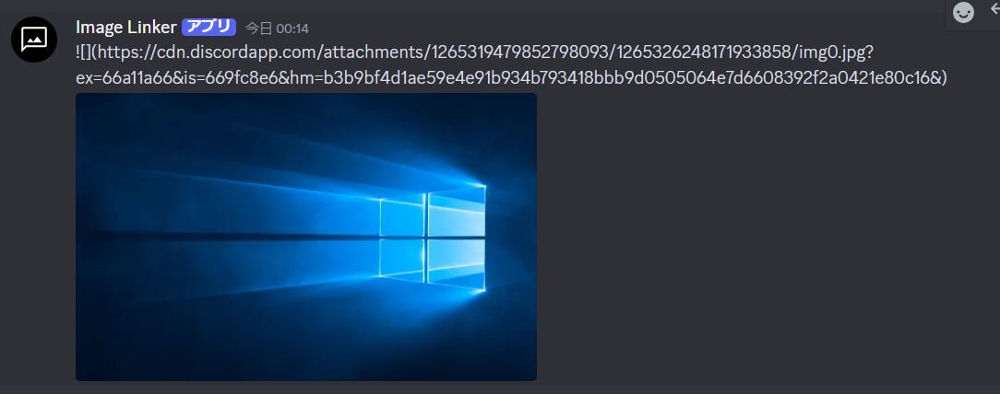

# Image-Linker

メディアファイルをmattermostにおけるリンク非表示記法を追加して返信するDiscord-botです。 
 

## コマンド
なし

## 使用上の注意等
- 添付ファイルの全てに反応するため，文書ファイルなど画像以外についても処理が実行されます。
- 確認した時点で，動画を同様の手順でmattermostに送信した場合は表示されません。(そもそもdiscord側のリンクへ飛ぶと動画がDLされる仕様のようです)
- プログラムの拙さについては初心者のため温かい目で見ていただけると助かります。またバグ修正等は脆弱性対応を除いてできない場合があります。

## 導入
- お使いのサーバーで常時起動させてください。
